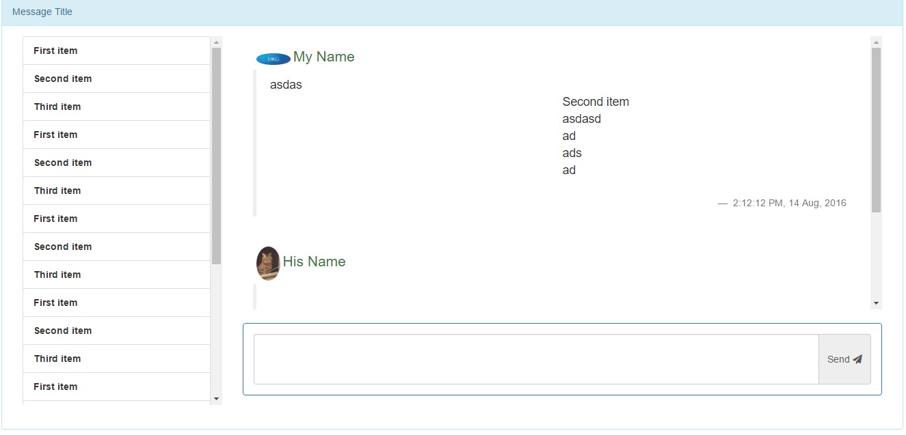
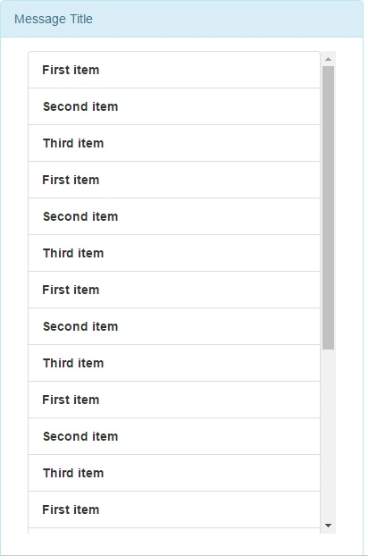
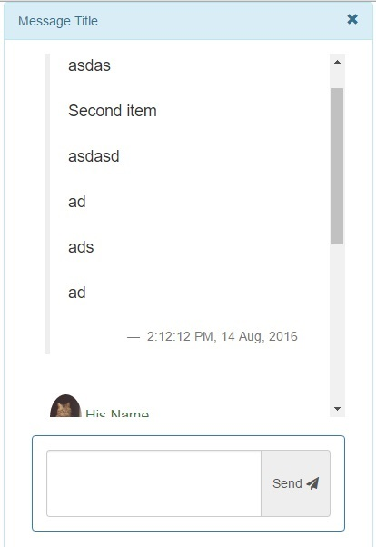

# Bootstrap Threaded Message

It is a easy to  use threaded message implementation which supports thereaded message view with mobile support (easily customisable and usable with AJAX).

So, 
## PC view-

## Mobile View-

### Normal View (Threads)

Before selecting any item

### Detail View (Message)

After selecting any item

Technology Used-

[Bootstrap 3.3.7](http://getbootstrap.com/getting-started/)